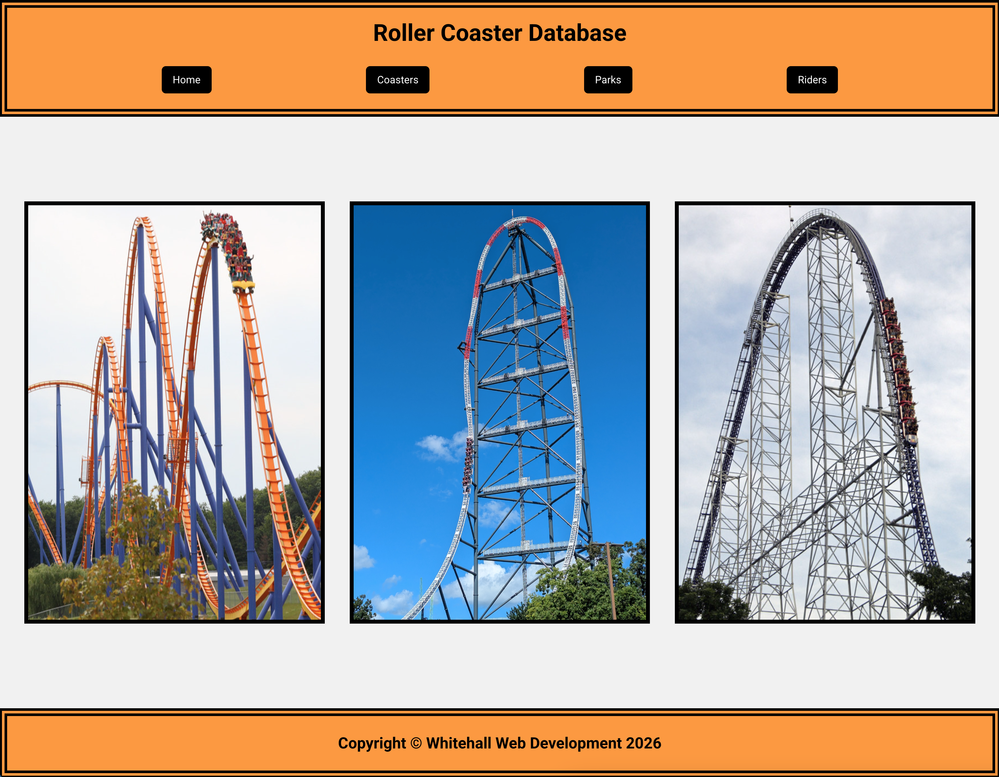
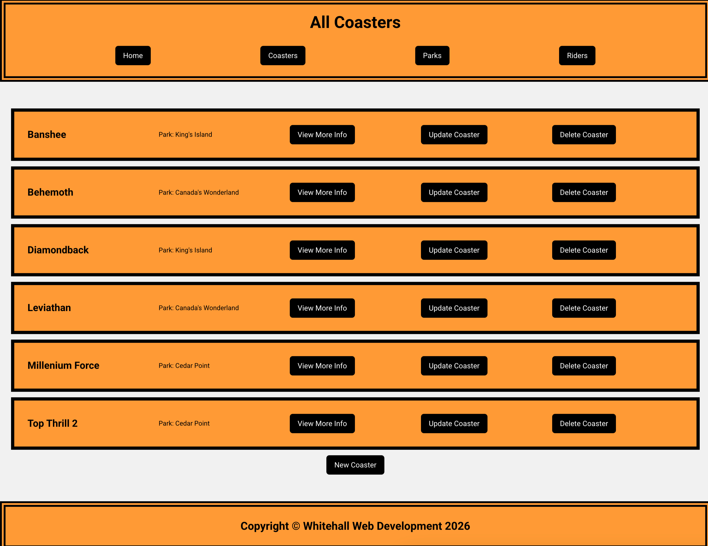
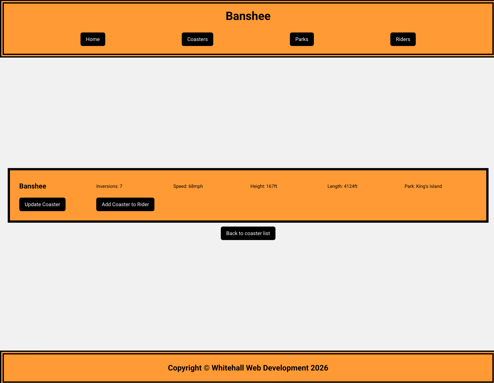
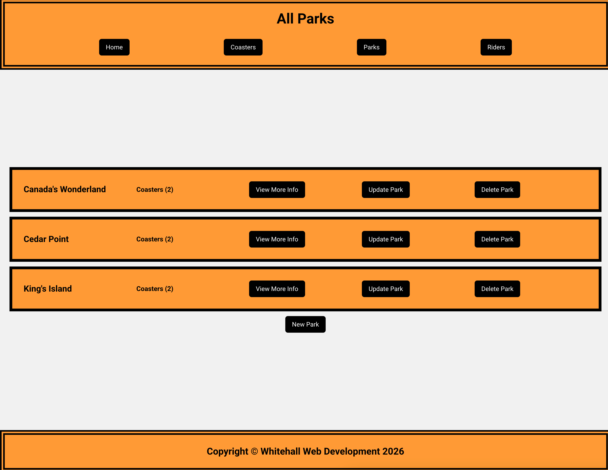
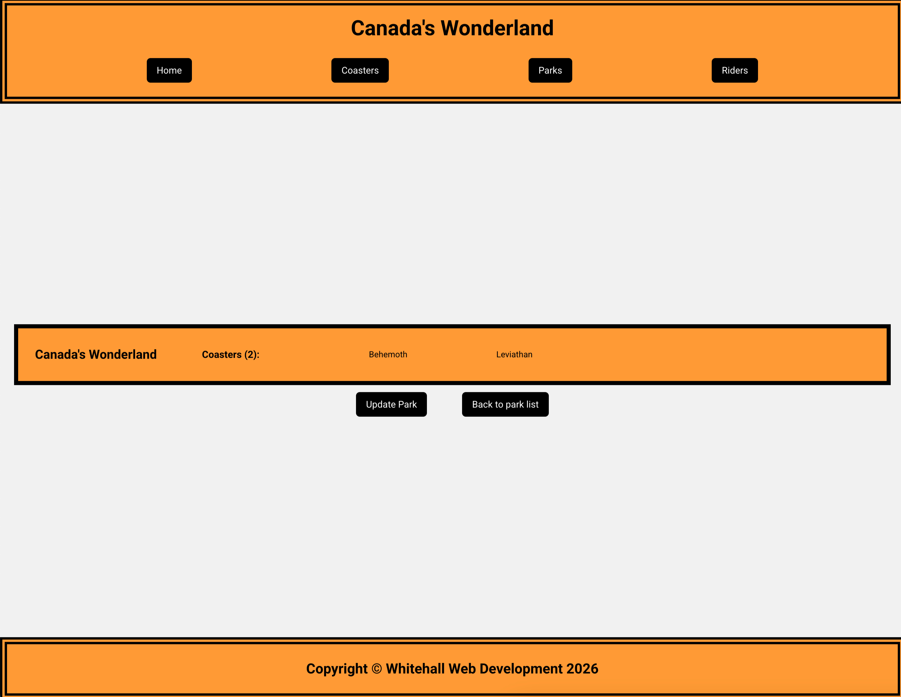
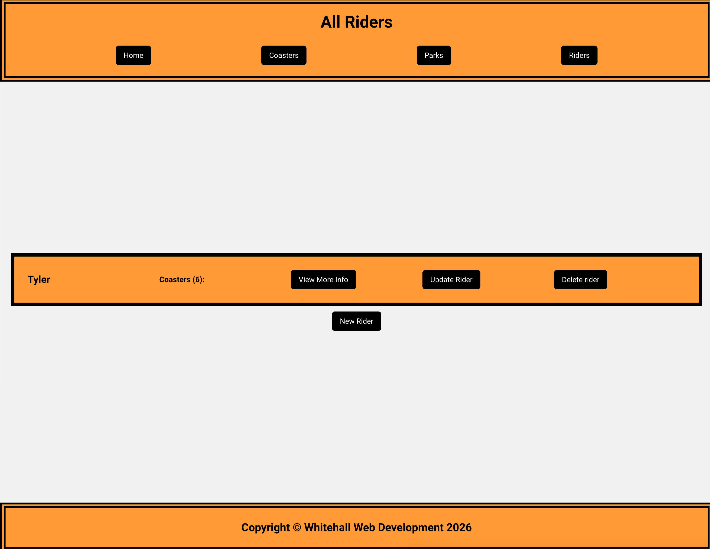
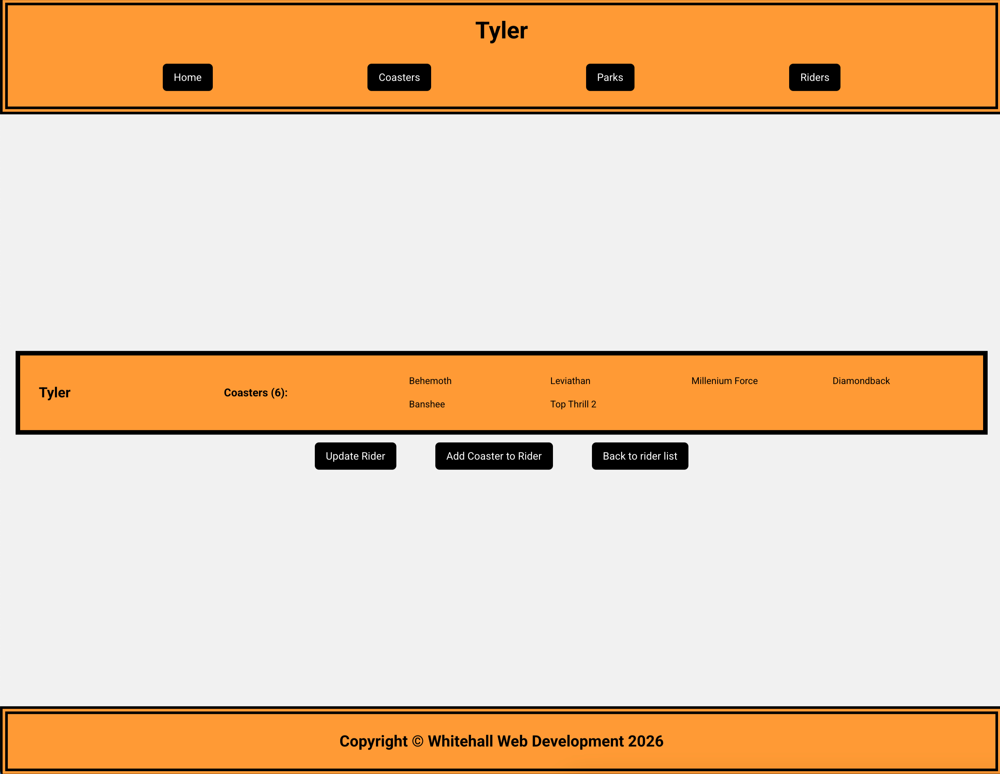

# Inventory Application
The goal of this project was to create an inventory app in Node.js using Express, EJS, Express-Validator and PostgreSQL.

## Features
1. Home page with nav bar for easy navigation to the coasters, parks and riders pages.


2. Coasters page that lists all coasters currently in the database with the park it's located in listed below it's name. As well as a new coaster button to add a new entry to the database.


3. Each coaster has a more info button to go to a specific page for just that coaster that displays more detailed info.


4. Each coaster has an update button to revise any information that may have been mistyped or if some details change like the park it's located in.
5. Each coaster has a delete button to remove it from the database, and from any park or rider it's associated with. 
6. Parks page that lists all parks currently in the database with a count of all coasters in the park listed below its name. As well as a new park button to add a new entry to the database.


7. Each park has a more info button to go to a specific page for just that park that displays a list of all coasters in the park by name.


8. Each park has an update button to revise the name if it was mistyped or if the name has changed.
9. Each park has a delete button to remove it from the database, and removes all coasters it's associated with.
10. Riders page that lists all riders currently in the database with a count of all coasters that person has ridden listed below their name. As well as a new rider button to add a new entry to the database.


11. Each rider has a more info button to go to a specific rider page for just that rider that displays a list of all coasters that person has ridden by name.


12. Each rider has an update button to revise the name if it was mistyped or if their name has changed.
13. Each rider has a delete button to remove it from the database. This does not remove the coasters that are associated with the rider, it just removes the link in the database.

## Installation

Before installing, ensure you have the following software installed:
**Git**: [Download Git](https://git-scm.com)
**Node.js**: [Download Node.js](https://nodejs.org)
**postSQL**: [Download postSQL](https://www.postgresql.org/)

1. **Clone the repository**
```git clone https://github.com/thall34/inventory-application```
2. **Navigate to the project directory**
```cd clone-location/inventory-application```
3. **Install dependencies**
```npm install```
4. **Configure .env file in project folder and add a DATABASE_URL variable and a NODE_ENV variable**
```DATABASE_URL=postgresql://<your-role-name>:<your-role-password>@localhost:5432/roller_coaster_database``` then ```NODE_ENV='development'```
5. **Create local database**
```psql -> CREATE DATABASE roller_coaster_database -> \q``` then ```node --env-file=.env db/populatedb.js``` to populate the database with appropriate tables
6. **Start the local server**
```node --env-file=.env app.js```
7. **Navigate to the localhost in your browser**
```http://localhost:3000```

## Future improvements

<ol>
    <li>Order coasters under park and under rider by name when viewing more info</li>
    <li>Update getCoasterIdFromName to include parkName as a second argument in case there are multiple of the same coaster</li>
    <li>Implement an update and delete button next to each coaster in the individual park view</li>
    <li>Implement a remove coaster from rider button</li>
</ol>